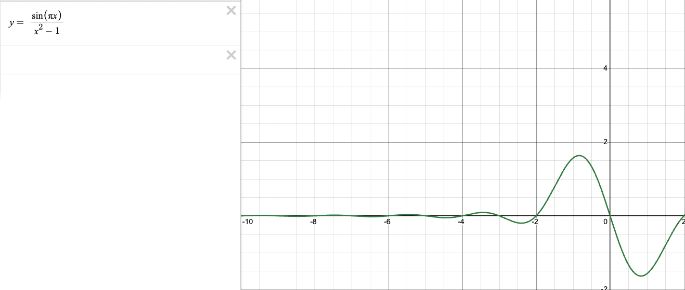
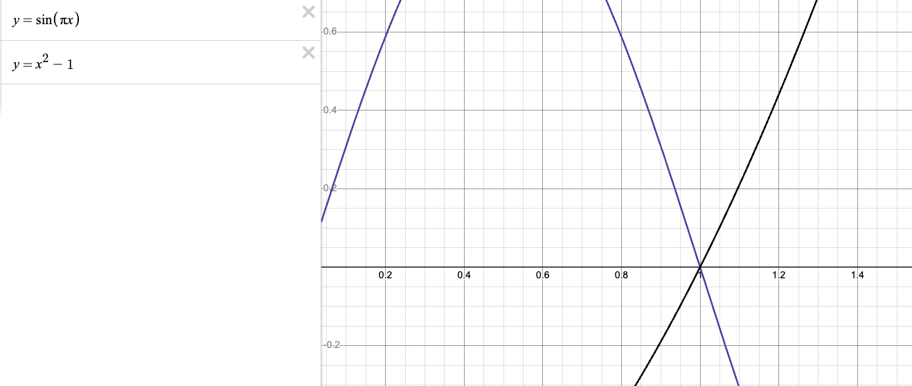

All exponential functions are proportional to their own derivative, but e is where this proportional value = 1

e.g.

M = 2^t

when we want to find the derivative of 2^t w.r.t. t, i.e. change of M with a very small change in t
can be represented as:

(2^(t + dt) - 2^t) / dt

Recapping from rules of exponent

x^(a + b) = x^a * x^b

(2^(t + dt) - 2^t) / dt 

===

(2^t * 2^dt - 2^t) / dt

2^t * ((2^dt - 1) / dt)

now t and dt are separate factors, such that the rate of change only depends on dt instead of both t and dt, since rate of change is more accurate as dt approaches 0.

dt -> 0

## Epsilon delta rule

Idea is that, when finding a gradient (rate of change at a point in a function), if we keep reducing the input range around a certain value into a smaller range iteratively, and we get closer and closer (almost converging) to a certain value as well ffor the output, then the function has a gradient at that point

e.g. input +- epsilon === output +- delta

Idea:

For some cases, finding the rate of change (gradient) at a point can return an undefined value.

Take for example:

($\frac{sin({\pi}x)}{x^2 - 1}$), where x = 1,

when we evaluate this function as is, we get:

($\frac{sin({\pi})}{1 - 1}$) = $\frac{0}{0}$

which is invalid,

However, when we look at the graph of these functions, we can see that it is continuous, we can have intuition that the above example might be incorrect:

When we split the function into 2 segments, we can see that a small change in x (dx) causes a change (increase in denominator) and (decrease in numerator)

From this we can have a deduction that when we are infinitely close / approaching this point, there is a visual proof that the gradient is a negative value (and hence not undefined).

We can boil this down to this derivation:

IFF:

$\frac{f(a)}{g(a)}$ = 0 // or some invalid value

$\lim_{x \to a}\frac{f(x)}{g(x)}$,

can be represented as:

 $\frac{\frac{df}{dx}(a)dx}{\frac{dg}{dx}(a)dx}$

 Taking the example:

 ($\frac{sin({\pi}x)}{x^2 - 1}$), where x = 1,

 $\lim_{x \to 1}\frac{sin({\pi}x)}{x^2 - 1}$

 Differentiating $\sin(\pi x)$ w.r.t. x:

 $\pi(cos(\pi x))$

 Differentiating $\ x^2 - 1$:

 $\ 2x $

 Plugging x = 1, we get:
 

 $\frac{\pi(cos(\pi ))}{2}$ = $\frac {- \pi}{2}$

 Note:

 $\cos(\pi)$ = -1,

### Taylor series

Transforming derivative information around a point into approximate information around a point

Radius of convergence (distance from point where value still converges)

